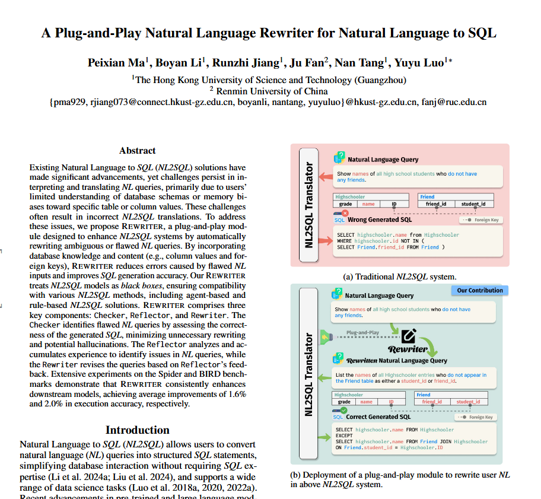
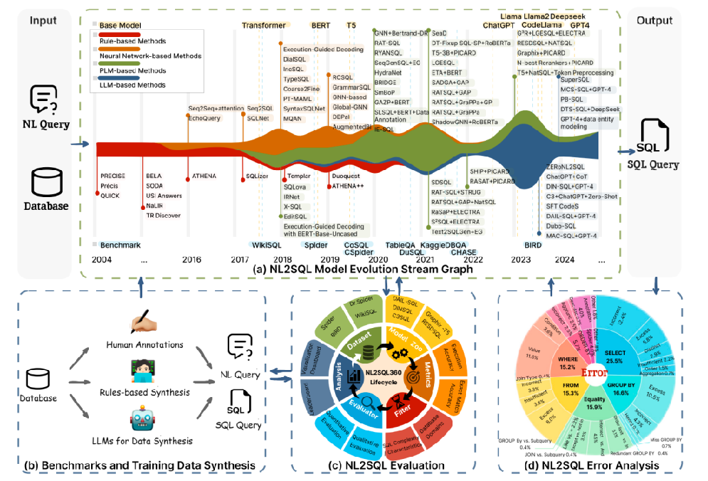
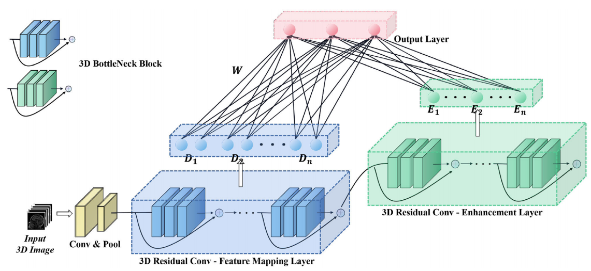

<link href="https://fonts.googleapis.com/css2?family=Open+Sans:wght@100;400;600;700&display=swap" rel="stylesheet">
<link href="https://fonts.googleapis.com/css2?family=Oswald:wght@100;400;600;700&display=swap" rel="stylesheet">

至于结果，只要你足够认真虔诚，总归不会错的。 2019.06.07

Hello! I am Peixian MA, a second-year M.Phil. student of [The Hong Kong University of Science and Technology GuangZhou (HKUSTGZ)](https://www.hkust-gz.edu.cn/). Now I am studying for a Master's degree of Philosophy in Data Science and Analytics under the supervision of [Prof. Yuyu Luo](https://luoyuyu.vip/) and [Prof. Nan Tang](https://nantang.github.io/), at the [Data Science and Analytics Thrust (DSA)](https://www.hkust-gz.edu.cn/zh/academics/hubs-and-thrust-areas/information-hub/data-science-and-analytics/), [Information Hub (INFH)](https://www.hkust-gz.edu.cn/zh/academics/hubs-and-thrust-areas/information-hub/).

I received the B.Eng. degree in Intelligence Science and Technology from [Jinan University (JNU)](https://english.jnu.edu.cn/) in 2023. I have started my research and learning live by working as the undergraduate research assistant in the Data-driven Intelligent Systems Laboratory of Jinan University. My undergraduate research direction is the optimization and application of the Broad Learning System (BLS). Before my graduation, I received the offer from HKUST(GZ) and successfully enrolled in it in the Fall 2023.

Currently, I participate in HKUST(GZ) Data Intelligence and Analytics Lab [@HKUST(GZ)-DIAL 呆鹅实验室](https://github.com/HKUSTDial) and Red Bird AI Agent Narrative Storytelling Game Groups [@AASG](). My research interest comprises Database Management (DBMS), Multi-agent System (MAS), Natural Language to SQL (NL2SQL) and Open-Source BLS. Here are the related links:

  <a href="ttps://github.com/HKUSTDial">Github</a>
  ·
  <a href="ttps://github.com/HKUSTDial">Homepage</a>

📟 News
=== 
* `2024.08` 📌 Long research paper [A Plug-and-Play Natural Language Rewriter for Natural Language to SQL]() completed and submitted to AAAI 2025. 
* `2024.08` 📌 First Survey of [@HKUST(GZ)-DIAL](https://github.com/HKUSTDial) NL2SQL Research Group: [A Survey of NL2SQL with Large Language Models: Where are we, and where are we going](https://arxiv.org/pdf/2408.05109) is available on *Arxiv*. *NL2SQL Handbook* link: [https://github.com/HKUSTDial/NL2SQL_Handbook](https://github.com/HKUSTDial/NL2SQL_Handbook). 

* `2024.01` 📌 Successfuly pass the PQA of the Red Bird M.Phil Program.
* `2023.07` 📌 Receive offers from The Hong Kong University of Science and Technology (GuangZhou) and The Chinese University of Hong Kong (ShenZhen).
* `2023.07` 📌 First long research paper: [Development and Validation of a Deep-broad Ensemble Model for Early Detection of Alzheimer’s Disease](https://www.frontiersin.org/journals/neuroscience/articles/10.3389/fnins.2023.1137557/pdf?isPublishedV2=false) is published in *Frontiers in Neuroscience*.

* `2023.05` 📌 Successfully pass the undergraduate graduation defense in Jinan University.

🎓 Education
======

  

    

      
    

    

        <h3>The Hong Kong University of Science and Technology (Guangzhou)</h3>
        
M.Phil. in Data Science and Analytics 2023.09 - 2025.07 (Expected)

    

  

  

    

      
    

    

      <h3>JiNan University</h3>
      
B.Eng. in Intelligence Science and Technology 2019.09 - 2023.07

    

  

📰 Publications
======

  

    

      
    

    

        <h3>A Plug-and-Play Natural Language Rewriter for Natural Language to SQL</h3>
        
<b>Peixian Ma</b>, Boyan Li, Runzhi Jiang, Yuyu Luo, Ju Fan and Nan Tang <b>Arxiv</b>

    

  

  

    

      
    

    

      <a href="https://arxiv.org/pdf/2408.05109">
        <h3>A Survey of NL2SQL with Large Language Models: Where are we, and where are we going</h3>
      </a>
      
Xinyu Liu, Shuyu Shen, Boyan Li, <b>Peixian Ma</b>, Runzhi Jiang, Yuxin Zhang, Ju Fan, Guoliang Li, Yuyu Luo and Nan Tang <b>Arxiv</b>

      
        
      
      
    

  

  

    

      
    

    

      <a href="https://www.frontiersin.org/journals/neuroscience/articles/10.3389/fnins.2023.1137557/pdf?isPublishedV2=false">
        <h3>Development and Validation of a Deep-broad Ensemble Model for Early Detection of Alzheimer's Disease</h3>
      </a>
      
<b>Peixian Ma</b>, Jing Wang, Zhiguo Zhou, C. L. Philip Chen  Alzheimer’s Disease Neuroimaging Initiative and Junwei Duan <b>Frontiers in Neuroscience 2023</b>

      
      
      
    

  

🏆 Selected Awards
===
> Academic Awards

* `2024.09` 🏅 Red Bird Postgraduate Scholarship of The Hong Kong University of Science and Technology (GuangZhou).
* `2023.09` 🏅 Red Bird Postgraduate Scholarship of The Hong Kong University of Science and Technology (GuangZhou).
* `2023.06` 🏅 Distinguished Graduate, College of Information Science and Technology, Jinan University.
* `2023.04` 🏅 Silver Award in "Medicine +X" Virtual Simulation Competition for College students, Jinan University & Guangzhou Medical University.
* `2022.12` 🏅 Second Class Scholarship for Excellent Student, Jinan University.
* `2021.12` 🏅 Third Class Scholarship Excellent Student, Jinan University.
* `2021.05` 🏅 Honorable Mention for Mathematical Contest In Modeling, Jinan University.

> Sport Awards

* `2024.04` 🥇 Champion of 2024 The Hong Kong University of Science and Technology (Guangzhou) Football Super League, RBM, *Central Defender, 4 Games,  2 Assist*.
* `2023.06` 🥉 Third Place of 2022 Jinan University Football Super League, College of Information Science and Technology, *Defensive Midfielder, 5 Games, 1 Goal, 2 Assist*.
* `2021.10` 🏆 Best Player of the Second Round in 2021 Jinan University Football Super League, Information Science and Technology.
* `2021.06` 🥇 Champion of 2020 Jinan University Football College Cup, College of Information Science and Technology, *Target Forward, 4 Games, 1 Goal, 1 Assist*.

💻Internships
===

* `2023.01` - `2023.06` : Research Assistant, Big Data Center. [@School of Journalism & Communication, Jinan University](https://xwxy.jnu.edu.cn/2018/1218/c12846a322831/page.psp)
  * Location: Guangzhou, China
  * Duties: Data Mining, Data Cleaning and Visualization 
  * Supervisor: Junjie HUA

* `2020.09` - `2022.12` : Research Assistant,  Data-driven Intelligent Systems Laboratory. [@College of Information Science of Technology, Jinan University](https://faculty.jnu.edu.cn/xxkxjsxy/djw/list.htm)
  * Location: Guangzhou, China
  * Duties: Conceptualization, Writing Draft, Validation, Data Visualization, Review and Project Administration
  * Supervisor: Junwei Duan, Yujuan Quan

🤖 Services
===
* Conference: 
  * Student Volunteer, 50th International Conference on Very Large Databases ([@VLDB 2024](https://vldb.org/2024/)), Guangzhou

📘 Study Stack
===

  

  

  

  

⚽ Football Life
===

<table>
  <tr>
    <td><b>Team</b></td>
    <td><b>Games</b></td>
    <td><b>Win</b></td>
    <td><b>Draw</b></td>
    <td><b>Loss</b></td>
    <td><b>Goal</b></td>
    <td><b>Assist</b></td>
  </tr>
  <tr>
    <td>The Hong Kong University of Science and Technology (Guangzhou) </td>
    <td>9</td>
    <td>6</td>
    <td>1</td>
    <td>2</td>
    <td><b>1</b></td>
    <td><b>3</b></td>
  </tr>
  <tr>
    <td>College of Information Science of Technology, JiNan University </td>
    <td>33</td>
    <td>20</td>
    <td>3</td>
    <td>10</td>
    <td><b>6</b></td>
    <td><b>4</b></td>
  </tr>
  <tr>
    <td>Happy My Lover of Class 3, ZhongYuan High School</td>
    <td>8</td>
    <td>4</td>
    <td>0</td>
    <td>4</td>
    <td><b>0</b></td>
    <td><b>1</b></td>
  </tr>
</table>

